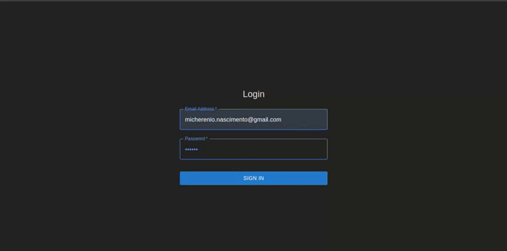

# 📥 React + Firebase(autenticação)

Bem-vindo ao React Auth App! Este é um projeto de autenticação simples usando React e Firebase. Ele utiliza Material-UI para uma interface de usuário moderna e `react-toastify` para exibir notificações.

## 🚀 Funcionalidades

- **Autenticação com Firebase**: Permite o login de usuários usando email e senha.
- **Interface Moderna**: Utiliza Material-UI para criar uma UI responsiva e elegante.
- **Notificações**: Feedbacks visuais com `react-toastify` para sucesso e erro de autenticação.

<br>



<br>

### Estrutura do projeto:

- `src/`: Contém o código-fonte da aplicação.
- `components/`: Componentes reutilizáveis da UI.
- `pages/`: Páginas da aplicação, como a página de login.
- `hooks/`: Hooks personalizados, como o `useAuth` para autenticação.
- `firebase.js`: Configuração e exportação dos serviços do Firebase.


```bash
React-Auth/
│
│
├── src/
│   ├── assets/
│   │   └── apresentacao.gif     # Imagens e outros assets estáticos
│   │
│   ├── components/
│   │   └── LoginForm.jsx        # Componente de formulário de login
│   │    
│   │
│   ├── firebase/
│   │   └── firebase.js          # Configuração e inicialização do Firebase
│   │
│   ├── hooks/
│   │   └── useAuth.js           # Custom hooks relacionados à autenticação
│   │
│   ├── pages/
│   │   ├── LoginPage.jsx        # Página de login, se você tiver várias páginas
│   │   └── (outras páginas)     # Outras páginas do aplicativo
│   │
│   ├── styles/
│   │   └── global.css           # Estilos globais
│   │
│   ├── utils/
│   │   └── helpers.js           # Funções utilitárias e helpers
│   │
│   ├── App.jsx                  # Componente principal do aplicativo
│   ├── main.jsx                 # Arquivo de entrada, inicialização do React
│   └── index.css                # Estilos principais
|              
├── index.html
├── .gitignore
├── index.html
├── package.json
└── vite.config.js

```

## 🛠️ Dependências

Este projeto utiliza as seguintes dependências:

- **React**: `^18.3.1`
- **Firebase**: `^10.12.5`
- **Material-UI**: `^5.16.6`
- **react-toastify**: `^10.0.5`
- **@emotion/react**: `^11.13.0`
- **@emotion/styled**: `^11.13.0`

## 📦 Instalação

Para começar a usar o projeto localmente, siga estas etapas:

### Clonar o Repositório

Clone o repositório para o seu ambiente local:

```sh
git clone https://github.com/micherenio-nascimento/React-Auth.git

cd react-auth-app

npm install

npm run dev

```

Abra seu navegador e acesse http://localhost:5173 para ver a aplicação em funcionamento.

## 🤔 Problemas e Contribuições
Se você encontrar problemas ou quiser contribuir para o projeto, sinta-se à vontade para abrir um issue ou enviar um pull request.


## Categoria
**frontend**